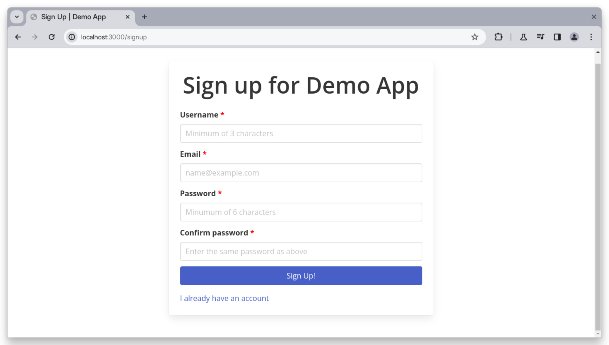

# E2E Testing Signup and Login Workflows with Playwright

This repo contains a demo application quipped with both registration and login
functionalities for demonstrating end-to-end testing through
[Playwright](https://playwright.dev).

**Tutorial**:
[E2E Testing Signup and Login Workflows with Playwright](https://betterstack.com/community/guides/testing/playwright-signup-login/).



## 🟢 Prerequisites

- Basic JavaScript knowledge.
- A working [Node.js environement](https://nodejs.org/en/download).

## 📦 Getting started

- Fork this repo to your GitHub account, then clone it to your machine as
  follows:

```bash
git clone https://github.com/<your_username>/playwright-signup-login
```

- Install the dependencies:

```bash
cd playwright-signup-login && npm install
```

- Start the development server:

```bash
npm start
```

- See the application in action at http://localhost:3000.

- [Follow the tutorial](https://betterstack.com/community/guides/testing/playwright-signup-login/)
  to learn more.

## ⚖ License

The code used in this project and in the linked tutorial are licensed under the
[Apache License, Version 2.0](LICENSE)
